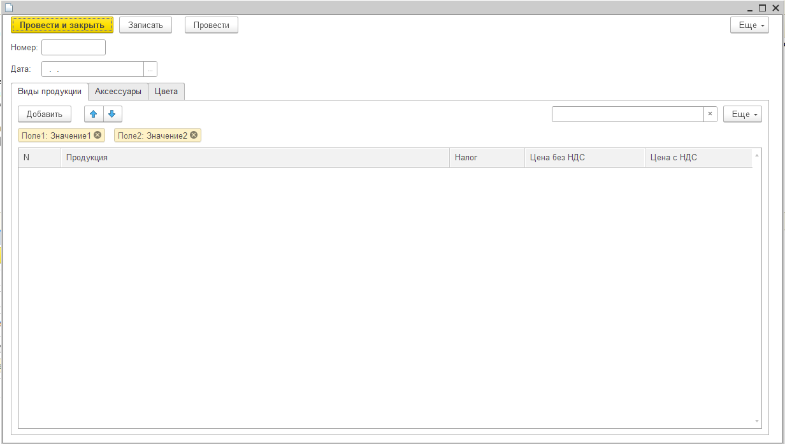
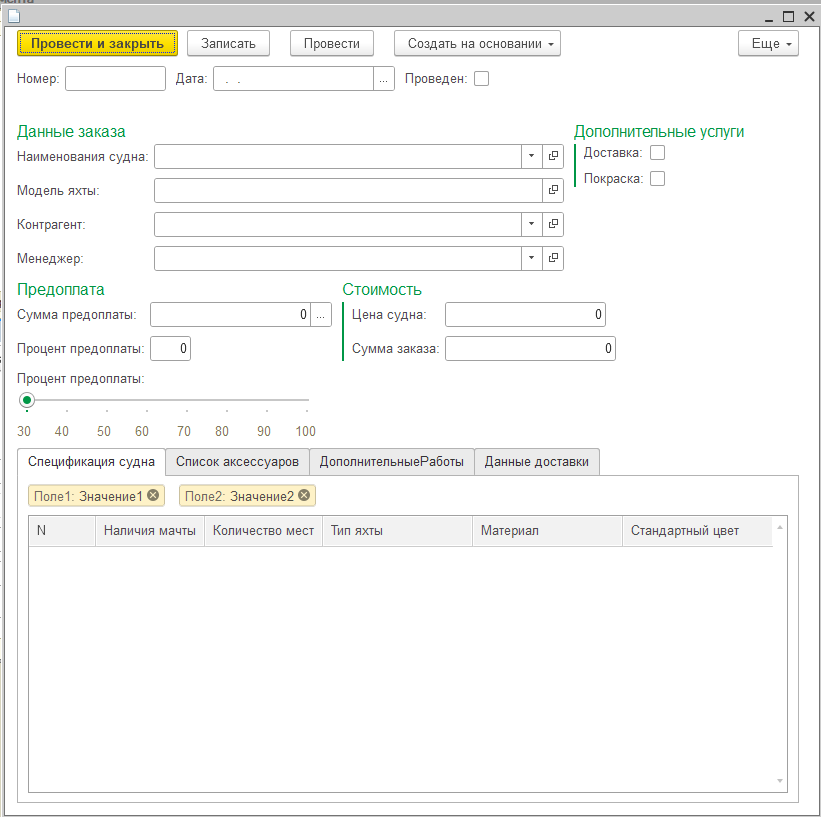
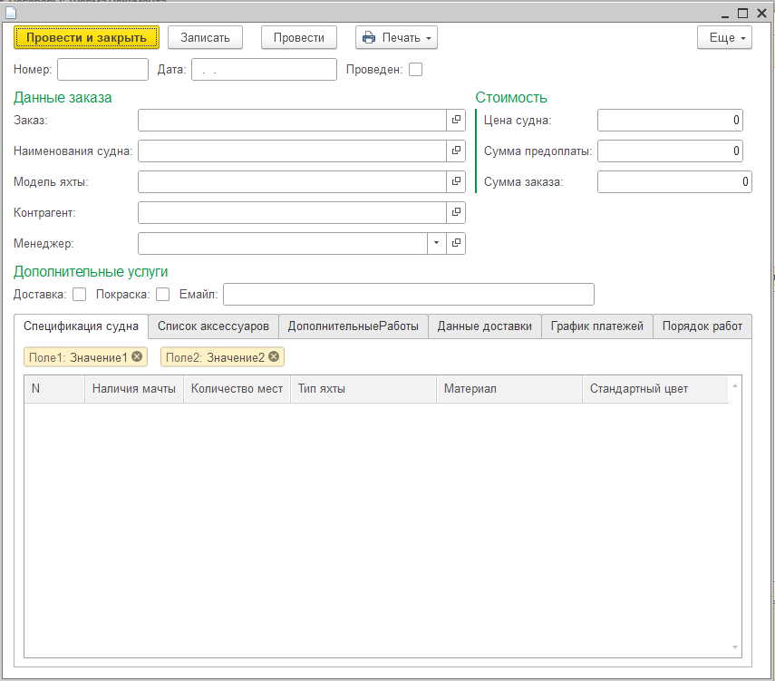

# Стажировка
В ходе стажировки был создан пример информационной базы для предприятия по продаже яхт покупателям. Получены широкие знания в разработке конфигурации для 1С:Предприятие 8.3.
______
Далее, будут перечислены объекты конфигурации. Формы созданные самостоятельно видны на скриноштах. Код из модулей форм приведен рядом.
## Объекты конфигурации
+ Общие
  1. Подсистемы
      + Прочее
      + СписокДокументов
      + СписокЗаказчиковИПоставщиков
      + СписокПродукции
  2. Общие модули
      + [ОбщиеФункции](#общие-функции)
  3. Роли
      + Администратор
      + Менеджер
  4. Общие формы
      + ОбщаяКартинка1
+ Справочники
  1. МоделиЯхт
  2. ТипыЯхт
  3. Материалы
  4. Цвета
  5. Аксессуары
  6. Продукция
  7. Сотрудники
  8. Города
  9. ВидыОПФ
  10. Контрагенты
  11. ВидыДокументов
+ Документы
  1. [УстановкаЦенНоменклатуры](#установка-цен-номенклатуры)
  2. [Заказы](#заказы)
  3. [Договоры](#договоры)
+ Отчеты
  1. ОтчетыПоПродажам
+ Регистры сведений
  1. ЦенаНоменклатуры
+ Регистры накоплений
  1. Продажи
### Общие функции
Код
```
Функция ЦенаНаДень(АктуальнаяДата, ЭлементПродукция) Экспорт
	Отбор = Новый Структура("Номенклатура", ЭлементПродукция);
	ЗначениеРесурсов = РегистрыСведений.ЦенаНоменклатуры.ПолучитьПоследнее(АктуальнаяДата, Отбор);
	Возврат ЗначениеРесурсов.Цена;	
КонецФункции
```
### Установка цен номенклатуры
Форма

Код
```
// Функции для получния налога
&НаСервере
Функция ПолучитьНалогПродукции(Продукция)
	Возврат Продукция.Налог;
КонецФункции

&НаСервере
Функция ПолучитьНалогАксессуара(Аксессуары)
	Возврат Аксессуары.Налог;
КонецФункции

&НаСервере
Функция ПолучитьНалогЦвета(Цвета)	
	Возврат Цвета.Налог;
КонецФункции

&НаКлиенте
Процедура ВидыПродукцииПродукцияПриИзменении(Элемент)
	Стр = Элементы.ВидыПродукции.ТекущиеДанные;
	Стр.Налог = ПолучитьНалогПродукции(Стр.Продукция);
	Стр.ЦенаСНДС = Окр((1 + Стр.Налог / 100) * Стр.ЦенаБезНДС, 2);
КонецПроцедуры

&НаКлиенте
Процедура ВидыПродукцииЦенаБезНДСПриИзменении(Элемент)
	Стр = Элементы.ВидыПродукции.ТекущиеДанные;
	Стр.ЦенаСНДС = Окр((1 + Стр.Налог / 100) * Стр.ЦенаБезНДС, 2);
КонецПроцедуры

&НаКлиенте
Процедура АксессуарыАксессуарыПриИзменении(Элемент)
	Стр = Элементы.Аксессуары.ТекущиеДанные;
	Стр.Налог = ПолучитьНалогАксессуара(Стр.Аксессуары);
	Стр.ЦенаСНДС = Окр((1 + Стр.Налог / 100) * Стр.ЦенаБезНДС, 2);
КонецПроцедуры

&НаКлиенте
Процедура АксессуарыЦенаБезНДСПриИзменении(Элемент)
	Стр = Элементы.Аксессуары.ТекущиеДанные;
	Стр.ЦенаСНДС = Окр((1 + Стр.Налог / 100) * Стр.ЦенаБезНДС, 2);
КонецПроцедуры

&НаКлиенте
Процедура ЦветаЦветПриИзменении(Элемент)
	Стр = Элементы.Цвета.ТекущиеДанные;
	Стр.Налог = ПолучитьНалогЦвета(Стр.Цвет);
	Стр.ЦенаСНДС = Окр((1 + Стр.Налог / 100) * Стр.ЦенаБезНДС, 2);
КонецПроцедуры

&НаКлиенте
Процедура ЦветаЦенаБезНДСПриИзменении(Элемент)
	Стр = Элементы.Цвета.ТекущиеДанные;
	Стр.ЦенаСНДС = Окр((1 + Стр.Налог / 100) * Стр.ЦенаБезНДС, 2);
КонецПроцедуры

```
### Заказы
Форма

Код
```

&НаСервере
Процедура НаименованияСуднаПриИзмененииНаСервере(Продукция)
	Запрос = Новый Запрос;
	Запрос.Текст = 
		"ВЫБРАТЬ
		|	Продукция.ТипЯхты КАК ТипЯхты,
		|	Продукция.КоличествоМест КАК КоличествоМест,
		|	Продукция.НаличиеМачты КАК НаличиеМачты,
		|	Продукция.Материал КАК Материал,
		|	Продукция.Цвет КАК СтандартныйЦвет,
		|	Продукция.МодельЯхты КАК МодельЯхты,
		|	ЦенаНоменклатурыСрезПоследних.Цена КАК Цена
		|ИЗ
		|	РегистрСведений.ЦенаНоменклатуры.СрезПоследних(&Дата, Номенклатура = &Продукция) КАК ЦенаНоменклатурыСрезПоследних
		|		ЛЕВОЕ СОЕДИНЕНИЕ Справочник.Продукция КАК Продукция
		|		ПО ЦенаНоменклатурыСрезПоследних.Номенклатура = Продукция.Ссылка
		|ГДЕ
		|	Продукция.Ссылка = &Ссылка";
	
	Запрос.УстановитьПараметр("Ссылка", Продукция);
	Запрос.УстановитьПараметр("Дата", Объект.Дата);
	Запрос.УстановитьПараметр("Продукция", Продукция);
	РезультатЗапроса = Запрос.Выполнить();
	
	Если РезультатЗапроса.Пустой() Тогда
		Сообщить("Недостаточно данных");
	Иначе
		Выборка = РезультатЗапроса.Выбрать();
		
		Пока Выборка.Следующий() Цикл
			Попытка				
				НоваяСтрока = Объект.СпецификацияСудна.Добавить();
				ЗаполнитьЗначенияСвойств(НоваяСтрока, Выборка);
				Объект.ЦенаСудна = Выборка.Цена;
				Объект.МодельЯхты = Выборка.МодельЯхты;
			Исключение
				Сообщить("Спецификация судна не заполнилась");	
			КонецПопытки;
			
		КонецЦикла;
	КонецЕсли;	
КонецПроцедуры

&НаКлиенте
Процедура НаименованияСуднаПриИзменении(Элемент)
	Объект.СпецификацияСудна.Очистить();
	Продукция = Объект.НаименованияСудна;
	НаименованияСуднаПриИзмененииНаСервере(Продукция);
	ОбновлениеСуммыЗаказ();
	ОбновлениеСуммыПредоплаты();
КонецПроцедуры

&НаКлиенте
Процедура СписокАксессуаровАксессуарПриИзменении(Элемент)
	Стр = Элементы.СписокАксессуаров.ТекущиеДанные;
	Стр.ЦенаСНДС = ОбщиеФункции.ЦенаНаДень(Объект.Дата, Стр.Аксессуар);
	Стр.СуммаСНДС = Стр.ЦенаСНДС * Стр.Количество;
	ОбновлениеСуммыЗаказ();
	ОбновлениеСуммыПредоплаты();
КонецПроцедуры

&НаКлиенте
Процедура СписокАксессуаровЦенаСНДСПриИзменении(Элемент)
	Стр = Элементы.СписокАксессуаров.ТекущиеДанные;
	Стр.СуммаСНДС = Стр.ЦенаСНДС * Стр.Количество;
	ОбновлениеСуммыЗаказ();
	ОбновлениеСуммыПредоплаты();
КонецПроцедуры

&НаКлиенте
Процедура СписокАксессуаровКоличествоПриИзменении(Элемент)
	Стр = Элементы.СписокАксессуаров.ТекущиеДанные;
	Стр.СуммаСНДС = Стр.ЦенаСНДС * Стр.Количество;
	ОбновлениеСуммыЗаказ();
	ОбновлениеСуммыПредоплаты();
КонецПроцедуры

&НаСервере
Процедура ПокраскаПриИзмененииНаСервере()
	Если Объект.Покраска = Истина Тогда
		Элементы.ГруппаДопРаботы.Видимость = Истина;
		Объект.СуммаЗаказа = Объект.СуммаЗаказа + Объект.ДопРаботы.Итог("ЦенаСНДС")
	Иначе
		Элементы.ГруппаДопРаботы.Видимость = Ложь;
		Объект.СуммаЗаказа = Объект.СуммаЗаказа - Объект.ДопРаботы.Итог("ЦенаСНДС"); 
	КонецЕсли;
КонецПроцедуры

&НаКлиенте
Процедура ПокраскаПриИзменении(Элемент)
	ПокраскаПриИзмененииНаСервере();
КонецПроцедуры

&НаСервере
Процедура ДоставкаПриИзмененииНаСервере()
	Если Объект.Доставка = Истина Тогда
		Элементы.ГруппаДанныеДоставки.Видимость = Истина;
	Иначе 
		Элементы.ГруппаДанныеДоставки.Видимость = Ложь;
	КонецЕсли;
КонецПроцедуры

&НаКлиенте
Процедура ДоставкаПриИзменении(Элемент)
	ДоставкаПриИзмененииНаСервере();
КонецПроцедуры

&НаКлиенте
Процедура ДопРаботыДопЦветПриИзменении(Элемент)
	Стр = Элементы.ДопРаботы.ТекущиеДанные;
	Стр.ЦенаСНДС = ОбщиеФункции.ЦенаНаДень(Объект.Дата, Стр.ДопЦвет);
	ОбновлениеСуммыЗаказ();
	ОбновлениеСуммыПредоплаты();
КонецПроцедуры

&НаКлиенте
Процедура СуммаПредоплатыПриИзменении(Элемент)
	Если Объект.СуммаПредоплаты > Объект.СуммаЗаказа Тогда
		Сообщить("Сумма предоплаты больше чем сумма заказа");
		Объект.СуммаПредоплаты = Объект.СуммаЗаказа;
		Объект.ПроцентПредоплаты = Объект.СуммаПредоплаты/Объект.СуммаЗаказа*100;
	ИначеЕсли Объект.СуммаПредоплаты < Объект.СуммаЗаказа*0.3 Тогда
		Объект.СуммаПредоплаты = Объект.СуммаЗаказа*0.3;
		Сообщить("Сумма предоплаты меньше минимальной");
		Объект.ПроцентПредоплаты = Объект.СуммаПредоплаты/Объект.СуммаЗаказа*100;
	Иначе
		Объект.ПроцентПредоплаты = Объект.СуммаПредоплаты/Объект.СуммаЗаказа*100;
	КонецЕсли;
КонецПроцедуры

&НаКлиенте
Процедура ПроцентПредоплаты1ПриИзменении(Элемент)
	Объект.ПроцентПредоплаты = Окр(Объект.ПроцентПредоплаты, - 1);
	ОбновлениеСуммыПредоплаты();
	ОбновлениеСуммыЗаказ();
КонецПроцедуры

&НаКлиенте 
Процедура ОбновлениеСуммыЗаказ()
	Объект.СуммаЗаказа = Объект.ЦенаСудна + Объект.СписокАксессуаров.Итог("СуммаСНДС") +
	Объект.ДопРаботы.Итог("ЦенаСНДС");
КонецПроцедуры

&НаКлиенте 
Процедура ОбновлениеСуммыПредоплаты()
	Объект.СуммаПредоплаты = Объект.СуммаЗаказа * (Объект.ПроцентПредоплаты/100);
КонецПроцедуры

&НаКлиенте
Процедура ПроцентПредоплатыПриИзменении(Элемент)
	ОбновлениеСуммыПредоплаты();
	СуммаПредоплатыПриИзменении(Элемент);
КонецПроцедуры

&НаСервере
Процедура ПриОткрытииНаСервере()
	Если Объект.Доставка = Истина Тогда
		Элементы.ГруппаДанныеДоставки.Видимость = Истина;
	Иначе 
		Элементы.ГруппаДанныеДоставки.Видимость = Ложь;
	КонецЕсли;
	Если Объект.Покраска = Истина Тогда
		Элементы.ГруппаДопРаботы.Видимость = Истина;
	Иначе
		Элементы.ГруппаДопРаботы.Видимость = Ложь;
	КонецЕсли;
КонецПроцедуры

&НаКлиенте
Процедура ПриОткрытии(Отказ)
	ПриОткрытииНаСервере();
КонецПроцедуры
```
### Договоры
Форма

Код
```

&НаСервере
Процедура ЗаполнитьНаСервере()
	Если ЗапускВПроизводство = '0001.01.01' Тогда
		Сообщить("Выбирите дату начала производства");
		Возврат;
	ИначеЕсли ЗапускВПроизводство < НачалоДня(ТекущаяДата()) Тогда
		Сообщить("Дата запуска в производстав не может быть меньше текущей даты");
		Возврат;
	КонецЕсли;
	Тз = Объект.НаименованияСудна.ПорядокРабот.Выгрузить();
	Тз.Колонки.Добавить("ДатаНачалаРабот");
	Тз.Колонки.Добавить("ДатаОкончанияРабот");
	Начало = ЗапускВПроизводство;
	Для каждого Стр из Тз Цикл
		Стр.ДатаНачалаРабот = Начало;
		Стр.ДатаОкончанияРабот = Начало + Стр.КоличествоДней*86400;
		Начало = Стр.ДатаОкончанияРабот + 86400;
	КонецЦикла;
	Объект.ПорядокРабот.Загрузить(Тз);
КонецПроцедуры

&НаКлиенте
Процедура Заполнить(Команда)
	ЗаполнитьНаСервере();
КонецПроцедуры

&НаКлиенте
Процедура РассчитатьГрафикПлатежей(Команда)
	Если Объект.КоличествоПлатежей = 0 Тогда
		Сообщить("Выберите количество платежей");
	ИначеЕсли Объект.ДатаПервогоПлатежа = '0001.01.01' Тогда
		Сообщить("Выберите дату первого платежа");
	ИначеЕсли НачалоДня(Объект.ДатаПервогоПлатежа) < Объект.Дата Тогда
		Сообщить("Дата первого платежа не может быть раньше даты оформления договора");
		Объект.ГрафикПлатежей.Очистить();
	Иначе
		Объект.ГрафикПлатежей.Очистить();
		ОстатокПоДоговору = Объект.СуммаЗаказа - Объект.СуммаПредоплаты;
		СуммаПлатежа = Окр(ОстатокПоДоговору/Объект.КоличествоПлатежей, 2);
		Для СЧ = 0 По Объект.КоличествоПлатежей - 1 Цикл 
			Стр = Объект.ГрафикПлатежей.Добавить();
			Стр.ДатаПлатежа = ДобавитьМесяц(Объект.ДатаПервогоПлатежа, СЧ);
			Стр.СуммаПлатежа = СуммаПлатежа;
			Стр.Остаток = ОстатокПоДоговору - Стр.СуммаПлатежа * (СЧ + 1);
		КонецЦикла;
	КонецЕсли;	
КонецПроцедуры

&НаСервере
Процедура ПриЗаписиНаСервере(Отказ, ТекущийОбъект, ПараметрыЗаписи)
	Элементы.Группа1.ТолькоПросмотр = Истина;
	Элементы.Группа2.ТолькоПросмотр = Истина;
	Элементы.ДопУслуги.ТолькоПросмотр = Истина;
	Элементы.Страницы.ТолькоПросмотр = Истина;
КонецПроцедуры

&НаКлиенте
Процедура ПриОткрытии(Отказ)
	Если Объект.Проведен = Истина Тогда
		Элементы.Группа1.ТолькоПросмотр = Истина;
		Элементы.Группа2.ТолькоПросмотр = Истина;
		Элементы.ДопУслуги.ТолькоПросмотр = Истина;
		Элементы.Страницы.ТолькоПросмотр = Истина;
	КонецЕсли;
КонецПроцедуры

```


